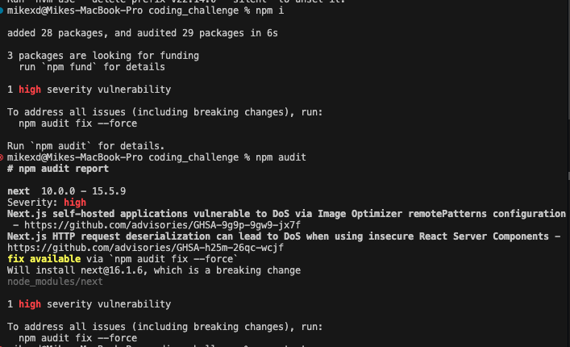
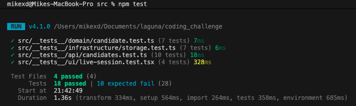
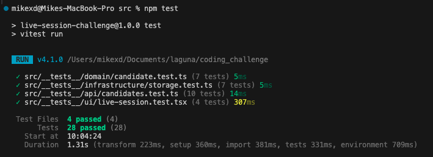

## Dev Logs

1. Analyze the codebase, a very minimal nextjs app with a single page for candidate management.

### PR feat/codebase-setup

- Found a high severity vulnerability in the codebase, it is a security risk and should be fixed immediately. Updated the nextjs version to the latest version not affected by the vulnerability, along with some syntax changes.
  
- I will implement the **tooling setup** first, it should be the foundation of any project, to aid developers to collaborate better by having a consistent code style and linting rules.
- I will also implement a light weight version of the **hexagonal architecture**, this is the foundation of the application and should be implemented before any other feature. This is to ensure that the application is scalable and maintainable. And separation of businese logic from the application layer which will also make it easier for me to test later on.
- I will implement the **business rules and validations**, this is the core of the application and should be implemented before any other feature.
- I will implement the **frontend**, this is the user interface of the application and should be implemented before any other feature.
- I will implement the **tests**, this is the foundation of the application and should be implemented before any other feature.

### PR feat/TDD-setup

- I will create the **vitest and playwright setup**, this is the foundation of the application and should be implemented before any other feature. I want to use vitest for unit testing and playwright for end-to-end testing. I will also implement a simple **CI/CD pipeline** using **GitHub Actions** to run the tests on every push to the main branch. Purpose of the test now is to see what functions are already working properly, and whats the gap in the current implementation.
  

### PR fix/business-rules-gap

- The candidate model is just a data bag right now, no validation, no transition guards, status is public and anyone can mutate it. All the **business logic** is sitting in route handlers which is not where it should be.
- I am going to make the model enforce its own rules — proper encapsulation, typed domain errors, and transition methods that only allow valid state changes. Route handlers should just catch errors and map them to HTTP codes.
- The 10 failing TDD tests already describe exactly what the model should do, so this is just filling in the gaps to make them pass.
  

### PR fix/shared-validation-frontend

- Right now validation only exists on the backend. The frontend lets you submit empty names and short reasons, then you get a 400 back with no helpful feedback. Also the page is doing raw fetch calls instead of using the service layer we already have.
- I want to extract the validation rules into a **shared module** that both backend and frontend can import. This way the rules live in one place and both sides stay in sync. The shared layer is just pure functions and constants, no domain model leaking to the frontend. Although this does violate the hexagonal architecture principle of separation of concerns, i feel it is still is a better alternative than having multiple places for the **business rules validation**.
- I also want to clean up the frontend to use the existing service layer, add proper inline validation, and hide the decision form when a candidate is already decided. And remove the empty application folder since we dont need it for this architecture.
- another architecture decision is the removal of **application folder**, since the nextjs structure have /api folder which kind of act as the driving adapter for the backend, and the domain model is the core of the application. So we dont need an application layer in this case, since there is only 1 domain. If there are cross domain interactions, then we might need an application layer to orchestrate the interactions.

### PR feat/frontend-shadcn-components

- The current frontend is a single massive page component with inline styles — fine for a prototype but hard to maintain or extend. I want to break it into proper **reusable components** and bring in **shadcn/ui** as the design system so everything is consistent and polished without writing custom CSS from scratch.
- The folder structure is also confusing right now — `src/ui/components/` for custom components, `src/components/ui/` for shadcn primitives, and `src/ui/api/` for the API client are all over the place. I want to consolidate into the **standard Next.js convention**: custom components at `src/components/`, shadcn primitives at `src/components/ui/`, and the API client at `src/lib/api/`. This way `npx shadcn add` keeps working out of the box and there is one obvious place for each thing.
- I will extract **CandidateBoard**, **CandidateCard**, **CreateCandidateForm**, **UpdateStatusForm**, **StatusBadge**, and **BusinessRules** as separate components. Each should own its own presentation logic and validation. The page component should become pure orchestration — fetch data, handle events, render components.
- I also want to move the **business rules** section to a **sticky bottom footer** so it is always visible while interacting with candidates. A small UX improvement — you should not have to scroll down to remember what transitions are allowed.
- I will also want to convert the UI to an actual candidate board that behaves like a trello task tracking board that can capture the process of a candidate going through the interview process.

### PR refactor/frontend-refactoring

- I will also implement tanstack query for data fetching and state management. This is a more robust solution than the current fetch implementation and will provide better performance and user experience.
- I will also introduce some optimistic-updates especially for card movements, to provide a better user experience.
- I will also add error-boundary to catch any errors that may occur during the rendering of the application.
- I will also refactor the frontend with accessibility features such as aria-labels, keyboard navigation, and screen reader support.

### PR feat/neon-adapter

- I will also implement neon as the database for the application. This is a more robust solution than the current in-memory storage implementation and will provide better performance and user experience.
- I will also implement a migration system to manage the database schema.
- I will also refactor the current repository pattern to improve the facade layer to support multiple database implementations.
- Chose not to change the current c_id to uuid, but if it is an actual production app, I would prefer to user uuid instead.
